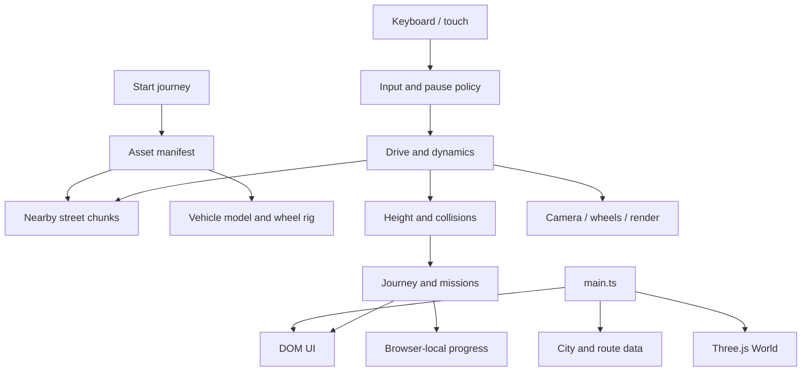

# Architecture

[简体中文](ARCHITECTURE.zh-CN.md) · [README](../README.md)

Shanghai Commute Drive is a client-side TypeScript application rendered by Three.js. Vite serves the development build and emits static files. There is no application server or business database. The city and asset manifests are inputs to the simulation, rather than executable application logic.

## Module boundaries

| Layer | Location | Responsibility |
| --- | --- | --- |
| Application lifecycle | `src/main.ts` | Load city data, create UI and world, coordinate route/car selection, start, pause, and animation frames |
| Input and focus | `src/core/input.ts`, `pause-policy.ts` | Keyboard/touch inputs, clear held controls on blur, require explicit resumption where appropriate |
| Driving | `src/tour/drive.ts`, `vehicle-dynamics.ts` | Route sampling, automatic/manual movement, speed response, fixed integration intervals and progress |
| Physical constraints | `collision.ts`, `driving-height.ts`, `vehicle-pitch.ts`, `road-clearance.ts` | Collision queries, elevation, car attitude, authoring clearance rules |
| Presentation | `world.ts`, `ui.ts` | Three.js scene/cameras/vehicles and DOM controls; orchestrate render quality and feedback |
| Asset lifetime | `street-streaming.ts`, `street-lod.ts`, `vehicle-model-cache.ts` | Select nearby chunks, prefetch, limit parallel loads, manage model reuse and disposal |
| Vehicle presentation | `wheels.ts`, `vehicle-materials.ts`, `vehicle-garage.ts` | Four-wheel hierarchy, appearance and explicitly labelled in-game measurements |
| Activities | `journey.ts`, `journey-world.ts`, `missions.ts`, `missions-world.ts` | Stops, collecting, parking/signals and progress |
| Browser persistence | `album.ts`, preferences/journey helpers | Local preferences/progress and IndexedDB photo storage |
| Asset preparation | `scripts/` | Author models, build runtime packages, back up and restore private assets |

## Startup and frame flow

Rendering and simulation are separate concerns. A fast render loop is not evidence of an accurate manufacturer powertrain model. The dynamics profiles are game calibrations; the UI's acceleration measurements must retain their measurement definition.

## Asset contract

The street manifest has a version, an array of `chunks`, and covered map way IDs. Each chunk declares an ID, file URL, byte length, world-space bounds, triangle count and optional SHA-256. The loader requests `chunk.file`; a `master.file` entry can describe an offline aggregate and is not automatically downloaded.

The same world coordinates are used for driving, rendered geometry and collision inputs. Asset processing must not move roads or independently change a tunnel surface while leaving collision data stale. A new resource pack must be validated as a coherent set.

The asset pipeline distinguishes spatial subdivision from transport encoding. A GLB split along spatial cells can load independently. Splitting compressed bytes into transport pieces alone does not produce independently renderable models. GLB export, texture processing, compression and bundling do not change the underlying asset license.

## Persistence and trust

Preferences and game progress remain in the current browser origin. Photos captured in the application are stored through IndexedDB. Switching hostname or port creates a different browser storage origin. This project does not synchronize local progress or photos between computers.

Data files and third-party models are untrusted inputs. New loaders must validate paths and manifests before fetching or writing. Repository credentials, cookies, absolute developer paths and agent session archives do not belong in the project or an asset pack.

## Extension points

- Add vehicles through the profile and vehicle asset mapping; preserve four independently controlled wheels. A license applies to both the main model and any traffic/preview derivatives.
- Add regions through city data and chunk manifests. Update collision geometry and the manifest together.
- Extend activities through journey/mission data and their controllers, rather than inserting state in the render loop.
- Add another renderer quality level in the render budget; measure the resulting behavior on target hardware.

## Known boundaries

The map is simplified and may be outdated. The software is not navigation, real driving instruction, a survey, or validated vehicle engineering. Documentation of a module does not imply that its behavior has been tested on every browser. See the release's verification record and [resource and recovery guide](RESOURCE_RECOVERY.md) for the restored private resource scope.
