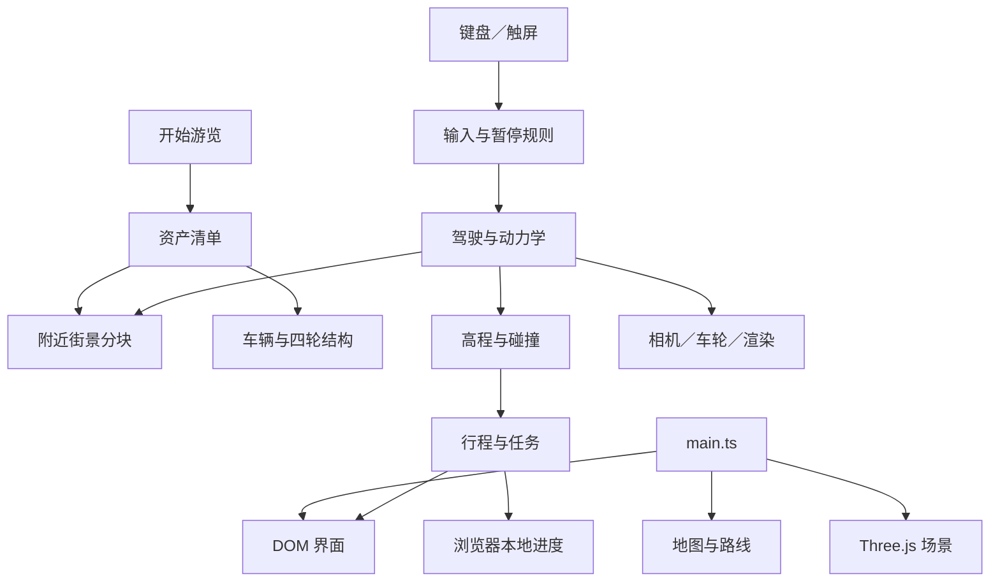

# 架构说明

[English](ARCHITECTURE.md) · [项目说明](../README.md)

上海漫游是由 Three.js 渲染的 TypeScript 浏览器应用。Vite 提供开发服务并生成静态文件；没有应用后端或业务数据库。城市数据和资产清单是仿真的输入，不是可执行的业务逻辑。

## 模块职责

| 层次 | 位置 | 职责 |
| --- | --- | --- |
| 应用生命周期 | `src/main.ts` | 加载地图、创建界面与场景，协调路线和车型切换、启动、暂停及逐帧更新 |
| 输入与焦点 | `src/core/input.ts`、`pause-policy.ts` | 键盘和触屏输入、失焦清空按键、需要时由用户明确继续 |
| 驾驶 | `src/tour/drive.ts`、`vehicle-dynamics.ts` | 路径采样、自动／手动行驶、速度响应、固定积分步长和进度 |
| 物理约束 | `collision.ts`、`driving-height.ts`、`vehicle-pitch.ts`、`road-clearance.ts` | 碰撞查询、高程、车身姿态和建模净空规则 |
| 展示 | `world.ts`、`ui.ts` | Three.js 场景、相机、车辆及 DOM 控件，组织画质和反馈 |
| 资产生命周期 | `street-streaming.ts`、`street-lod.ts`、`vehicle-model-cache.ts` | 选择附近分块、预加载、限制并发加载、模型复用和资源释放 |
| 车辆表现 | `wheels.ts`、`vehicle-materials.ts`、`vehicle-garage.ts` | 四轮层级、材质与明确标注的游戏内测量结果 |
| 游览活动 | `journey.ts`、`journey-world.ts`、`missions.ts`、`missions-world.ts` | 观景点、收藏、停车／信号灯与进度 |
| 浏览器存储 | `album.ts`、偏好及行程辅助函数 | 本地偏好／进度、IndexedDB 相册 |
| 资产准备 | `scripts/` | 建模、生成运行包、备份和恢复私有资源 |

## 启动和逐帧流程

渲染与仿真是不同职责。画面流畅不能证明厂家动力系统复现准确；动力学配置属于游戏调校，车库的加速测量数据必须保留其测量定义。

## 资产接口

街景清单包含版本、`chunks` 数组和覆盖的地图 way ID。每块记录 ID、文件 URL、字节数、世界坐标范围、三角面数和可选 SHA-256。加载器请求 `chunk.file`；`master.file` 可以记录离线总模型，但不会因此自动下载总模型。

驾驶、渲染几何与碰撞输入共用世界坐标。资产处理不能移动道路，也不能只修改隧道路面而保留过期碰撞数据。资源包必须作为相互匹配的一组文件验证。

空间分块与传输编码分别处理：按区域生成的独立 GLB 可以分别加载；把压缩字节切成若干片段不会自动得到可独立渲染的模型。导出、改贴图、压缩和打包均不会改变资产原有许可。

## 持久化与信任边界

偏好和行程保存在当前浏览器源中，游戏拍摄的照片使用 IndexedDB。主机名或端口改变会形成不同的存储源。本项目不会自动跨电脑同步进度和相册。

数据文件和第三方模型属于外部输入。新增加载流程应验证路径与清单，再进行读取或写入。账号凭据、Cookie、开发者绝对路径及 agent 会话档案不属于源码或资源包。

## 扩展方式

- 通过动力学配置与资产映射增加车型，保留独立四轮结构；主模型、交通模型和预览图分别遵守来源许可。
- 通过城市数据和分块清单增加区域，同时更新碰撞数据。
- 在行程／任务数据及其控制器中增加活动，避免把活动状态直接塞进渲染循环。
- 在画质预算中新增档位，并在目标硬件上实际测量。

## 已知边界

地图经过简化，数据也可能过时。项目不是导航、真实驾驶教学、测绘成果或经过验证的车辆工程模型。介绍某个模块不意味着它已在所有浏览器验证；私有恢复范围见版本验证记录和[资源与恢复说明](RESOURCE_RECOVERY.md)。
